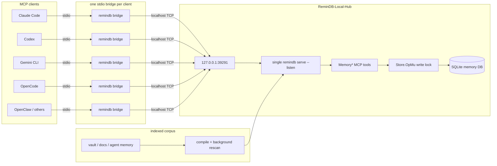
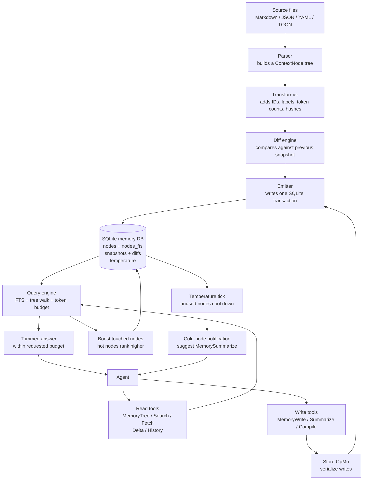

<h1 align="center">ReminDB-Local-Hub</h1>

<p align="center">
  Agentic memory in a single SQLite file.
  <br />
  Stop letting your agent re-read the same notes every session.
</p>

---

## ReminDB-Local-Hub

ReminDB-Local-Hub makes the `remindb` binary work correctly on Windows and multi-agent workstations. Pre-built releases are published from `v0.1.0` onwards for linux / darwin / windows × amd64 / arm64.

The original `remindb serve` command is stdio-first: each MCP client normally starts its own server process. That is fine for one terminal, but it is the wrong topology when Claude Code, Codex, Gemini, and other agents all point at the same SQLite database. ReminDB-Local-Hub runs exactly one DB-owning server and lets every MCP client connect through a tiny stdio bridge.

What ReminDB-Local-Hub adds:

- `remindb serve --listen 127.0.0.1:39291` for a singleton local MCP server.
- `remindb bridge` so existing stdio MCP clients can connect to that singleton server.
- FTS5 query hardening for real vault terms such as `three-tier`, `LR-2026-...`, `NEAR(three-tier stack)`, and `three-tier*`.
- Windows path-prefix compatibility so the test suite and path hashing behave correctly on Windows.
- `install.ps1` and `install.sh` installers on the `main` branch root, plus tag-triggered GoReleaser builds; `remindb update` reinstalls in place.



### Topology choice

The `remindb` binary supports two shapes. Both are valid; the right one depends on how many clients share the database.

| Shape | Process model | When to use |
|---|---|---|
| **Per-client `serve`** (simpler) | The MCP client spawns its own `remindb serve` on stdio and opens the `.db` directly. SQLite WAL handles multi-process safety, but every additional client duplicates the rescan loop and fragments temperature counters across processes. | 1 client. The simplest possible wiring. |
| **Singleton `serve --listen` + per-client `bridge`** (marquee, supports 2-20 clients) | One `remindb serve --listen 127.0.0.1:39291` owns the DB. Each client spawns `remindb bridge`, which forwards stdio MCP frames over loopback TCP. Diagram above. | 2 or more concurrent clients sharing one DB, up to ~20. One process owns rescan, write serialization, and the cold-node notifier; temperature counters stay coherent. |

Per-client `serve` is the single-client shape — one MCP client speaks stdio to one `remindb serve`, which owns the `.db`. No diagram needed; it is just `client -> remindb serve -> .db`.

Migration between the two shapes is reversible — swap `serve` for `bridge --addr ...` in each client's MCP config. The MCP tool surface is identical either way.

Security boundary: ReminDB-Local-Hub is for localhost. MCP has no auth here; do not bind `--listen` to a public interface.

## Why This Exists

Coding agents already have memory. `CLAUDE.md`, `AGENTS.md`, your notes folder, that growing pile of project READMEs. Stuff persists just fine.

The problem is *how* the agent consumes it. Every session starts by re-reading the whole pile from scratch — every `Read`, every `Grep`, scanning raw prose the agent has already processed dozens of times. Big context windows don't fix it. A 1M-token window is still paid per call, and still can't tell yesterday's stale note from today's relevant one.

Raw markdown is the wrong shape for memory. Not because it can't hold the words — it can — but because it forces the agent to pay full freight on every read.

`remindb` is a single SQLite file your agent treats as long-term memory. It parses your notes (Markdown, JSON, YAML, [TOON](https://github.com/toon-format/toon)) into a structured tree, hashes every node, encodes repetitive structures compactly when it saves tokens, and surfaces the whole thing through a tight MCP tool suite.

### What you get

**A tree the agent can index, not skim.** Instead of `ls`-ing a folder and reading every file to orient, the agent calls `MemoryTree` once. Each entry is a typed node — `[heading]`, `[list]`, `[kv]`, `[table]`, `[preamble]`, `[text]`, `[code]` — with an ID, a short label, a temperature, and a token count. Think of it as `ls -la` for memory: one call, a scannable index, hot stuff floats up.

A real slice (from `remindb inspect --tree`):

```
[preamble] Preamble: framework, language, project (id=3kGXxidmWBp file=CLAUDE.md temp=0.50 tok=14)
[heading] Project Instructions (id=6EuIVj5zt5j file=CLAUDE.md temp=0.75 tok=5)
  [heading] Architecture (id=603qfsg4qd2 temp=0.88 tok=3)
    [text] Next.js 15 conventions with a clear separation of data… (id=3GGuLAq3yNP temp=0.82 tok=111)
    [list] 7-item list: app/, components/, lib/, db/, hooks/, types… (id=ITAKw5NVNPt temp=0.71 tok=228)
  [heading] Data Model (id=FQwpXL4bm6Y temp=0.62 tok=3)
    [list] 7-item list: products, variants, orders, carts, users, s… (id=Il8jcgTJOGt temp=0.55 tok=155)
  [heading] Payment Integration (id=LTQZLSkPsDW temp=0.30 tok=5)
    [text] Stripe Payment Intents; not legacy Checkout Sessions… (id=GLbXrUYs32G temp=0.24 tok=35)
  [heading] Observability (id=2wkOdf47OjR temp=0.08 tok=4)
    [list] 4-item list: Sentry · Vercel logs · OTel tracing · Prom… (id=C1HCYSAOkpu temp=0.08 tok=90)
```

A fresh compile starts every node at `temp=0.50`. The spread above is what an agent sees after a few sessions of reading. *Architecture* is hot because the agent keeps coming back to it. *Observability* has gone cold and will get flagged for summarization on the next nudge.

**Hot vs. cold, like a real cache.** Each node has a temperature that rises when the agent reads it and decays over time. Hot nodes rank higher in search. Cold nodes don't disappear — they just stop crowding the top of results.

**Summarization that happens when it should.** When a node crosses the cold threshold, the MCP server pushes a notification straight to the agent: *this has gone cold, consider compacting it.* The agent calls `MemorySummarize` with a shorter rewrite. The node shrinks in place, keeps its anchor in the tree, keeps its version history. No cron, no external worker — it happens in-band, driven by how the memory actually gets used.

**Git-style versioning, free.** Every compile or write lands a snapshot. Linear parent chain, fingerprinted by a `cursor_hash`. Per-node diffs (`add` / `mod` / `rem`, with old and new content) sit alongside. `MemoryDelta` hands the agent only what changed since its last cursor — a tiny resync instead of a whole-file re-read.

**TOON encoding where it pays off.** Arrays of uniform objects (configs, tables, list-of-dicts) store ~40% smaller in TOON than in YAML or JSON. The parser tries both shapes per node, keeps whichever wins by ≥15%, and records the choice in a `format` column. Irregular prose stays as plain text — TOON has nothing to offer there, so we don't pretend.

**FTS5 search, not grep.** Search runs on SQLite's FTS5 virtual table, built at write time with a porter tokenizer over labels, content, and types. `MemorySearch` returns ranked anchors in milliseconds — no file rescans, no regex timeouts — and trims to whatever token budget you pass. Ask for 500 tokens of matches, get exactly 500.

**Portable by design.** The whole memory is one `.db` file. Copy it to another machine, hand it to another agent, commit it into a repo, sync it across devices. Upstream stdio mode lets one MCP-capable agent point `serve` at the file directly. ReminDB-Local-Hub adds a localhost singleton so Claude Code, Codex, Gemini CLI, OpenCode, OpenClaw, and similar harnesses can share one local DB owner through `bridge`.

### Memory logic



## Install

The fastest path is the one-liner installer for the latest release. It resolves the matching archive for your OS + architecture, verifies SHA256 against `checksums.txt`, and drops the binary into the standard per-user install location.

### One-liner (Windows PowerShell)

```powershell
irm https://raw.githubusercontent.com/special-place-administrator/remindb-Local-Hub/main/install.ps1 | iex
```

Binary lands at `%LOCALAPPDATA%\Programs\remindb\bin\remindb.exe`. If that directory is not on `PATH`, the installer prints the persistent-add snippet:

```powershell
[Environment]::SetEnvironmentVariable(
  "Path",
  [Environment]::GetEnvironmentVariable("Path", "User") + ";$env:LOCALAPPDATA\Programs\remindb\bin",
  "User"
)
```

Open a new terminal after changing PATH.

### One-liner (Linux / macOS)

```bash
curl -sSf https://raw.githubusercontent.com/special-place-administrator/remindb-Local-Hub/main/install.sh | sh
```

Binary lands at `~/.local/bin/remindb`. Same SHA256 verification flow.

### From source (Go 1.26+)

Source builds are still supported if you need an unreleased commit or a non-tier-1 platform.

Linux / macOS:

```bash
git clone https://github.com/special-place-administrator/remindb-Local-Hub.git
cd remindb-Local-Hub
go test ./...
go build -o ~/.local/bin/remindb ./cmd/remindb
```

Windows PowerShell:

```powershell
git clone https://github.com/special-place-administrator/remindb-Local-Hub.git
cd remindb-Local-Hub
go test ./...
go build -o .\remindb.exe .\cmd\remindb

$installDir = "$env:LOCALAPPDATA\Programs\remindb\bin"
New-Item -ItemType Directory -Force -Path $installDir | Out-Null
Copy-Item .\remindb.exe "$installDir\remindb.exe" -Force
```

### Verify

```bash
remindb --version
```

Expect `remindb version vX.Y.Z` matching the latest release tag.

### Create a database

Choose one source directory and one database path. The source is the authored corpus your agents should query: a docs repo, notes directory, Obsidian vault, or agent memory folder.

Linux / macOS:

```bash
mkdir -p ~/.cache/remindb
remindb compile /absolute/path/to/notes --db ~/.cache/remindb/notes.db
```

Windows PowerShell:

```powershell
$source = "C:\absolute\path\to\notes"
$db = "$env:LOCALAPPDATA\remindb\notes.db"
New-Item -ItemType Directory -Force -Path (Split-Path $db) | Out-Null
remindb compile $source --db $db
```

Optional but recommended: put a `.remindb.ignore` file at the source root to exclude session logs, dependency folders, build outputs, caches, secrets, and generated files. The same ignore file is honored by `compile`, the background rescan loop, and `MemoryCompile`.

### Configure MCP clients

For ReminDB-Local-Hub, every MCP client should spawn `remindb bridge`, not `remindb serve`. The bridge talks to one singleton local server:

```text
client stdio -> remindb bridge -> 127.0.0.1:39291 -> one remindb serve --listen process -> one .db
```

Use the same `--addr`, `--db`, and `--source` for every agent that should share the database.

**Singleton lifecycle.** Something has to own the `serve --listen` process. Recommended setups:

- **Windows:** `remindb service install --db <path> --source <dir> --listen 127.0.0.1:39291` (see [`service`](#service-windows-only) below). The Service Control Manager keeps the singleton running across reboots, windowless, logging to `C:\ProgramData\remindb\service.log`.
- **Linux / macOS:** a `systemd` user unit or `launchd` agent invoking `remindb serve --listen ...` is the cleanest. Or a long-lived shell for one-off use.
- **Fallback:** `remindb bridge` itself will auto-spawn a singleton if none is reachable within `--startup-timeout`. Good enough for casual use; less reliable than an SCM-managed service.

#### Claude Code

User-level config is usually `~/.claude.json` on Linux / macOS and `%USERPROFILE%\.claude.json` on Windows. Add or replace the server entry:

```json
{
  "mcpServers": {
    "remindb": {
      "type": "stdio",
      "command": "remindb",
      "args": [
        "bridge",
        "--addr", "127.0.0.1:39291",
        "--db", "/absolute/path/to/notes.db",
        "--source", "/absolute/path/to/notes",
        "--rescan-interval", "60s"
      ],
      "env": {}
    }
  }
}
```

Windows paths are fine, but use forward slashes or escaped backslashes in JSON:

```json
"--db", "C:/Users/you/AppData/Local/remindb/notes.db",
"--source", "C:/Users/you/Documents/notes"
```

Restart Claude Code and run `/mcp`; `remindb` should show the full `Memory*` tool suite.

#### Codex

Add this to `~/.codex/config.toml`:

```toml
[mcp_servers.remindb]
command = "remindb"
args = [
  "bridge",
  "--addr", "127.0.0.1:39291",
  "--db", "/absolute/path/to/notes.db",
  "--source", "/absolute/path/to/notes",
  "--rescan-interval", "60s"
]
```

Windows example:

```toml
[mcp_servers.remindb]
command = "C:/Users/you/AppData/Local/Programs/remindb/bin/remindb.exe"
args = [
  "bridge",
  "--addr", "127.0.0.1:39291",
  "--db", "C:/Users/you/AppData/Local/remindb/notes.db",
  "--source", "C:/Users/you/Documents/notes",
  "--rescan-interval", "60s"
]
```

Restart Codex and check `/mcp` in the TUI.

#### Gemini CLI

Gemini extensions can use the bundled `plugins/gemini-cli/` extension, which now launches `remindb bridge`. Set the DB and source before launching Gemini:

```bash
export REMINDB_DB=/absolute/path/to/notes.db
export REMINDB_SOURCE=/absolute/path/to/notes
export REMINDB_RESCAN_INTERVAL=60s
git clone https://github.com/special-place-administrator/remindb-Local-Hub.git ~/code/remindb-Local-Hub
gemini extensions install ~/code/remindb-Local-Hub/plugins/gemini-cli
gemini mcp list
```

On Windows PowerShell:

```powershell
[Environment]::SetEnvironmentVariable("REMINDB_DB", "C:/Users/you/AppData/Local/remindb/notes.db", "User")
[Environment]::SetEnvironmentVariable("REMINDB_SOURCE", "C:/Users/you/Documents/notes", "User")
[Environment]::SetEnvironmentVariable("REMINDB_RESCAN_INTERVAL", "60s", "User")
gemini extensions install C:\path\to\remindb-Local-Hub\plugins\gemini-cli
gemini mcp list
```

Open a new terminal after setting user environment variables.

#### Generic stdio MCP harness

Any MCP client that accepts a stdio command should use this shape:

```json
{
  "mcpServers": {
    "remindb": {
      "type": "stdio",
      "command": "remindb",
      "args": [
        "bridge",
        "--addr", "127.0.0.1:39291",
        "--db", "/absolute/path/to/notes.db",
        "--source", "/absolute/path/to/notes",
        "--rescan-interval", "60s"
      ],
      "env": {}
    }
  }
}
```

Do not configure multiple clients to run `remindb serve --db same.db`. `serve` owns the database; `bridge` is what clients spawn.

## How it's put together

Two phases, one SQLite file in between. The compiler turns source files into versioned nodes at ingest time. The MCP runtime answers the agent in milliseconds on every call. The `.db` is the entire handoff — copy it, commit it, sync it.

| Layer | Responsibility |
|-------|----------------|
| **Parser** | One dispatcher, format-specific stages for Markdown, YAML, JSON/JSONL, TOON. Emits a unified `[]*ContextNode` tree with `id`, `parent_id`, `label`, `content`, `node_type`, `depth`, `token_count`, `content_hash`. |
| **Transformer** | Generates 11-char base62 IDs (xxhash64), estimates cl100k-base tokens, compresses whitespace, decides plain vs. TOON per node. |
| **Diff Engine** | Compares the fresh AST against the last snapshot, produces `add`/`mod`/`rem` deltas, hashes the full state into a new `cursor_hash`. |
| **Emitter** | Writes nodes, diffs, and the new snapshot in one transaction; maintains the FTS5 index via triggers. |
| **Store** | SQLite with WAL mode. Tables: `nodes`, `snapshots`, `diffs`, `cursors`, plus the `nodes_fts` virtual table. |
| **Query Engine** | Token-budgeted context assembly. Walks ancestors and descendants via `parent_id`, ranks by relevance weighted by temperature, formats output. |
| **Temperature** | Boosts on read, decays on a tick. Cold nodes get flagged for summarization. |
| **MCP Server** | `modelcontextprotocol/go-sdk` over stdio. Registers the `Memory*` tool suite, dispatches to the query engine, and notifies clients when nodes go cold. |
| **Rescan Loop** | Optional background goroutine that polls the source directory and triggers incremental recompilation without bringing the server down. |

## CLI

Seven subcommands, one shared flag (`--db`). Skip `--db` on a directory and remindb derives `./{dirname}.db` automatically.

```
remindb compile <path>   Ingest files or a directory into the database
remindb serve            Start the MCP server (stdio or --listen)
remindb bridge           Bridge stdio MCP clients to a singleton local server
remindb service          Manage the Windows Service for the singleton (Windows only)
remindb inspect          Dump DB stats; optionally render the node tree or file list
remindb bench            Measure token savings vs. raw-file baselines
remindb update           Reinstall remindb by re-running the install script
```

### `compile`

One-shot ingestion of a file or directory. Creates a new snapshot and records diffs against the previous one.

```bash
remindb compile ./notes # → ./notes.db
remindb compile ./notes --db memory.db -m "add Q2 notes"
remindb compile ./docs/architecture.md --db project.db
remindb compile ./notes --reseed-temperatures # force .temp.json values onto unchanged nodes
```

| Flag | Purpose |
|------|---------|
| `--db PATH` | Target database. Default: derived from the source directory name, else `memory.db`. |
| `-m, --message` | Snapshot message (defaults to `compile:<path>`). |
| `--reseed-temperatures` | Push `.temp.json` values through to nodes whose source files didn't change on disk. Directory compiles only; no new snapshot. See [Pre-seeding temperatures with `.temp.json`](#pre-seeding-temperatures-with-tempjson). |

#### Filtering with `.remindb.ignore`

Drop a `.remindb.ignore` at the source root to exclude paths from `compile`, the `serve` rescan loop, the `MemoryCompile` tool, and `bench`. Gitignore-style subset — patterns, comments, blank lines.

```
# .remindb.ignore
*.jsonl              # session logs are large and unhelpful
sessions/            # any directory called sessions, at any depth
**/cache/**          # nested cache trees
cache/scratch.md     # exact relative path
!cache/keep.md       # re-include one file (last-match-wins)
/anchored.md         # leading / anchors to the source root
fo?.md               # ? matches exactly one char
file[abc].md         # [abc] matches one char from the set
\!literal.md         # backslash escapes a leading ! or #
```

#### Pre-seeding temperatures with `.temp.json`

Drop a `.temp.json` at the source root to set initial temperatures for files at compile time. JSON object, values are floats in `[0, 1]`. Read on `compile`, the `serve` rescan loop, and the `MemoryCompile` tool.

```json
{
  "*": 0.3,
  "README.md": 0.9,
  "src/api/routes.yaml": 0.95,
  "src": {
    "*": 0.6,
    "api": {
      "deprecated.json": 0.1
    },
    "internal": 0.4
  },
  "docs/": 0.4
}
```

Slash-keys and nested objects mix freely — `"src/api/routes.yaml"` and `{"src": {"api": {"routes.yaml": …}}}` mean the same thing. Values can sit on files (`README.md`), directories (`internal`, `docs/`), or a `*` glob that fills in the rest at the same level. Resolution walks the path segment by segment and takes the most specific match: a file key beats a sibling `*`, which beats an ancestor's default.

Two keys that resolve to the same leaf with disagreeing values fail at load time with the offending path named. Missing file is silently skipped; everything starts at the engine default of `0.50`.

Supported: numbers in `[0, 1]`, nested objects, slash-keys, `*` glob at any level, leading `./` and trailing `/` (both normalized). Anything else — out-of-range numbers, string values, leading `/`, `..` segments, empty segments from `//` — fails the command at startup with the offending key named.

By default, edits to `.temp.json` reach only the nodes whose source files also changed in the same compile — agent activity (`MemoryFetch` boosts, the decay tick) shouldn't be wiped silently every time the workspace is recompiled. Pass `remindb compile <dir> --reseed-temperatures` when you mean it: the flag overrides stored temperatures for every node whose source file is keyed in `.temp.json`, regardless of whether its content changed. The reseed pass is a temperature update, not a content change, so it does not create a new snapshot. The flag only applies to directory compiles (`compile <dir>`); single-file compiles ignore it, and the `MemoryCompile` MCP tool does not expose it (agents cannot use it to overwrite their own temperature signal).

### `serve`

Starts the MCP server on stdio. With `--source` set, remindb runs an initial compile (if the DB is empty) and keeps a background rescan loop running.

```bash
remindb serve --db ./notes.db --source ./notes
remindb serve --db ./notes.db --source ./notes --rescan-interval 30s -v
remindb serve --listen 127.0.0.1:39291 --db ./notes.db --source ./notes
```

| Flag | Env | Purpose |
|------|-----|---------|
| `--db` | `REMINDB_DB` | Database file. |
| `--source` | `REMINDB_SOURCE` | Source directory to watch and incrementally recompile. |
| `--rescan-interval` | `REMINDB_RESCAN_INTERVAL` | e.g. `30s`, `5m`. `0` keeps the tracker's default. |
| `--listen` | — | Local TCP address for multi-client MCP sessions. Empty keeps stdio mode. |
| `-v, --verbose` | — | Debug-level logs. Default is info. |

### `bridge`

Starts a stdio MCP adapter that connects to a singleton local `serve --listen` process. If the singleton is not already running, `bridge` starts it and then connects.

Use this in MCP client configs when several agents or terminals share the same `.db`:

```bash
remindb bridge --addr 127.0.0.1:39291 --db ./notes.db --source ./notes --rescan-interval 60s
```

| Flag | Env | Purpose |
|------|-----|---------|
| `--db` | `REMINDB_DB` | Database file owned by the singleton server. |
| `--source` | `REMINDB_SOURCE` | Source directory passed to the singleton server if it must be started. |
| `--rescan-interval` | `REMINDB_RESCAN_INTERVAL` | Rescan interval passed to the singleton server if it must be started. |
| `--addr` | `REMINDB_BRIDGE_ADDR` | Local singleton address. Default: `127.0.0.1:39291`. |
| `--startup-timeout` | — | How long the bridge waits for the singleton to become reachable. |

Do not configure every MCP client to run `remindb serve --db same.db`. Use `bridge` for clients and let one local server own the database.

### `service` (Windows only)

Manage the singleton `remindb serve --listen` process as a Windows Service so it starts at boot, runs windowless under the Service Control Manager, and writes structured logs to a known file path. Sub-subcommands: `install`, `uninstall`, `start`, `stop`, `status`.

```powershell
# One-time registration (UAC prompt — SCM requires admin):
remindb --db C:/claude-obsidian/primus-cloud.db service install `
  --listen 127.0.0.1:39291 `
  --source C:/claude-obsidian/primus-cloud `
  --rescan-interval 60s

# Inspect:
remindb service status

# Stop / start:
remindb service stop
remindb service start

# Remove:
remindb service uninstall
```

| Flag | Default | Purpose |
|------|---------|---------|
| `--listen` | `127.0.0.1:39291` | TCP listen address baked into the service args. |
| `--source` | (empty) | Source directory baked into the service args. |
| `--rescan-interval` | `60s` | Rescan interval baked into the service args. |
| `--start-type` | `auto-delayed` | Service start type: `auto-delayed`, `auto`, `manual`, `disabled`. |
| `--log-file` | `C:\ProgramData\remindb\service.log` | Where the SCM-spawned `serve` writes its slog output (stdio is not connected for services). |

The installed service uses the SCM dispatch loop (`golang.org/x/sys/windows/svc`) — `Stop` and `Shutdown` signals cancel the serve context cleanly, draining the rescan + tracker goroutines before reporting `Stopped`. After install, all MCP clients should be configured with `remindb bridge --addr 127.0.0.1:39291 ...`; the service owns the DB, the bridges fan out.

### `inspect`

Read-only snapshot of what's in a database. Without `--tree` or `--files` it prints stats; `--tree` renders the node hierarchy (temperatures colour-coded blue cold → red hot); `--files` renders the compiled source files grouped by compile root.

```bash
remindb inspect --db ./notes.db
remindb inspect --db ./notes.db --tree --depth 6
remindb inspect --db ./notes.db --files
```

| Flag | Purpose |
|------|---------|
| `--tree` | Render the node tree. |
| `--files` | Render compiled source files grouped by compile root. |
| `--depth N` | Maximum depth when rendering. Default: `10`. Requires `--tree`. |

`NO_COLOR=1` disables the ANSI palette.

### `bench`

Runs the scenario suite — tree · search · fetch · delta — against one database and prints token savings compared to a naive *list + read + grep* baseline.

```bash
remindb bench \
  --db ./notes.db --dir ./notes --budget 1000 \
  --query "WebSocket idempotency" --query "Snowflake COPY INTO"
```

| Flag | Purpose |
|------|---------|
| `--dir` | Source directory (inferred from the DB path if omitted). |
| `--budget` | Token budget for search and fetch scenarios. Default: `1000`. |
| `--query` | Repeatable. Skips the search scenario when empty. |

### `update`

Reinstalls remindb in place by re-running `install.ps1` (Windows) or `install.sh` (Linux / macOS) from the `main` branch of this repo. Picks up the latest GitHub release.

```bash
remindb update
```

`serve` background-checks GitHub releases on startup and emits an `info` log when a newer tag is available, with `hint=remindb update` — so the prompt to upgrade comes from the server, the upgrade itself is one command.

## MCP tools

A `Memory*` tool suite, registered once, surfaced to any MCP-capable agent (Claude Code, Codex, Gemini CLI, OpenCode, OpenClaw, …).

| Tool | Purpose |
|------|---------|
| **`MemoryTree`** | Renders the full node hierarchy with labels, types, IDs, temperatures, and token counts. The agent's cheap orientation call. |
| **`MemorySearch`** | FTS5 full-text search over labels and content. Returns ranked anchors within a token budget. |
| **`MemoryFetch`** | Returns one anchor plus its ancestors and children, trimmed to a token budget. The "read just this region" call. |
| **`MemoryWrite`** | Writes or updates content at an anchor. Creates a new snapshot and a per-node diff. |
| **`MemoryDelta`** | Returns only the nodes that changed since a given snapshot cursor. Lets agents resync with a tiny payload instead of re-reading files. |
| **`MemoryHistory`** | Browses the version history of a node — who/when/how it changed, rollback-capable via stored old content. |
| **`MemorySummarize`** | Replaces a node's content with a shorter summary the agent provides. Used when the temperature tracker flags a cold node. |
| **`MemoryCompile`** | Compiles source files or a directory into the database from inside a session. Same engine as the `compile` CLI. |

### Agent integrations

Five plugin folders ship with the repo, one per supported coding agent. Each has a manifest matching that agent's spec, an MCP stanza, and a README with install commands, env-var conventions, and a worked example that compiles the agent's own memory folder into remindb.

| Agent | Folder | Install docs |
|-------|--------|--------------|
| Claude Code | [`plugins/claude-code/`](./plugins/claude-code/) | [plugins/claude-code/README.md](./plugins/claude-code/README.md) |
| Gemini CLI | [`plugins/gemini-cli/`](./plugins/gemini-cli/) | [plugins/gemini-cli/README.md](./plugins/gemini-cli/README.md) |
| Codex | [`plugins/codex/`](./plugins/codex/) | [plugins/codex/README.md](./plugins/codex/README.md) |
| OpenCode | [`plugins/opencode/`](./plugins/opencode/) | [plugins/opencode/README.md](./plugins/opencode/README.md) |
| OpenClaw | [`plugins/openclaw/`](./plugins/openclaw/) | [plugins/openclaw/README.md](./plugins/openclaw/README.md) |

> [!TIP]
> **Pair the plugin with the two companion skills** — [`remind`](./skills/remind/) (read path) and [`memoize`](./skills/memoize/) (write path). They teach the agent the MCP tool suite so you don't re-explain it each session. Per-agent install instructions live in [`skills/README.md`](./skills/).

For any other MCP-capable agent, add this to its MCP config by hand:

```json
{
  "mcpServers": {
    "remindb": {
      "type": "stdio",
      "command": "remindb",
      "args": ["bridge", "--addr", "127.0.0.1:39291", "--db", "/absolute/path/to/memory.db", "--source", "/absolute/path/to/notes", "--rescan-interval", "60s"],
      "env": {}
    }
  }
}
```

On startup the agent sees the full `Memory*` tool suite alongside its usual toolbox. A reasonable first prompt:

```
Call MemoryTree to orient. Then call MemorySearch for "<topic>" with budget 1000
and MemoryFetch on the top hit. Explain what you learned and which files it came from.
```

## Benchmarks

Token counts are measured against the naive baseline an agent falls back to without a memory layer: list the directory, read every matching file, grep through it. Numbers come from `./scripts/bench-agents.sh` over the five plugin fixtures in `testdata/`, plus a one-off compile of a real Obsidian vault (~100 markdown files across AI concepts, market briefs, security notes, and MOCs — ~600k naive tokens end-to-end).

The scenario suite (tree · 3 searches · fetch · delta) rolls up into three workflow categories:

- **context window** — a single `MemoryTree` orientation call.
- **context gathering** — 3 × `MemorySearch` + `MemoryFetch` + `MemoryDelta`, token-weighted.
- **total session** — sum of both.

> [!NOTE]
> **Corpus size moves the numbers in remindb's favour.** The plugin fixtures are ~3k–20k tokens each; the vault is ~600k. As the corpus grows, the naive baseline scales linearly (more files to list, more bytes to grep, more prose to re-read), while remindb's answers stay bounded by the token budget you pass. That's why the vault's context-gathering row hits **99.3%** — every search still returns ~800 tokens, but the baseline is now 15–20× larger.
>
> The scenario list is also intentionally short. A real 30-minute agent session does dozens of orient/search/fetch/write/re-orient cycles, and the same search often fires three or four times as the agent loops on a problem. Each of those calls compounds toward **90%+ full-session savings** on realistic corpora.

<sub>The `obsidian vault` row is a real vault: ~100 markdown files, ~600k naive tokens.</sub>

Reproduce the table yourself:

```bash
./scripts/bench-agents.sh
```

## Contributing

Patches, bug reports, and installation notes are welcome. The guide lives in [`CONTRIBUTING.md`](./CONTRIBUTING.md).

## License

MIT — see [`LICENSE`](LICENSE).
